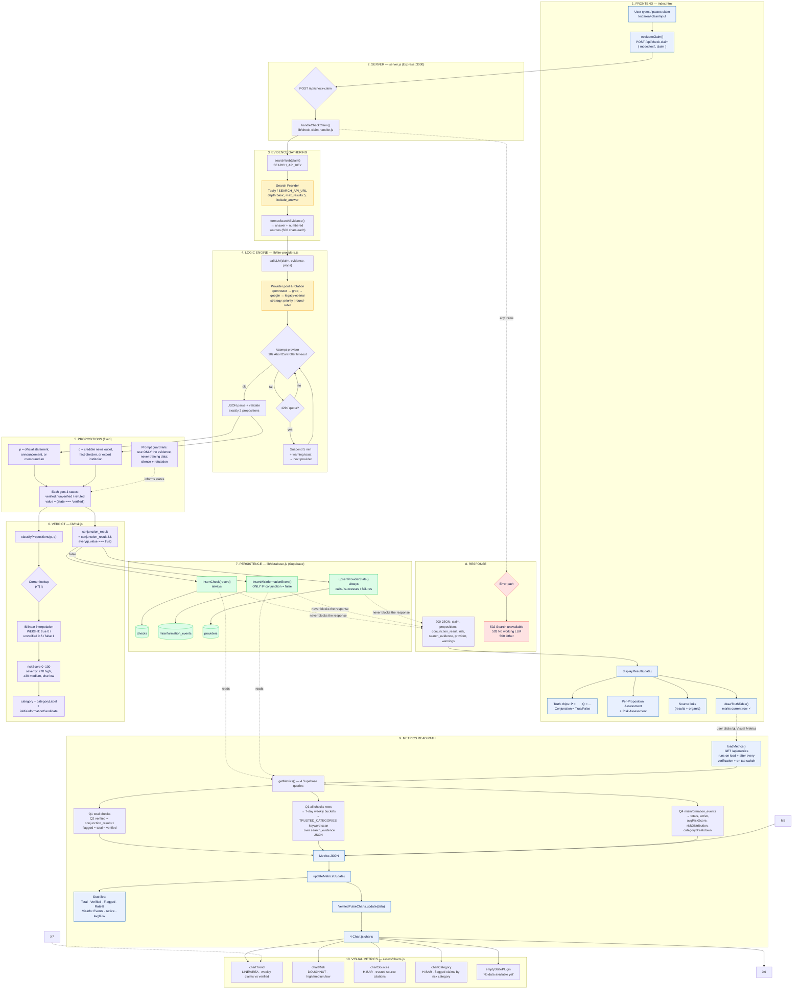
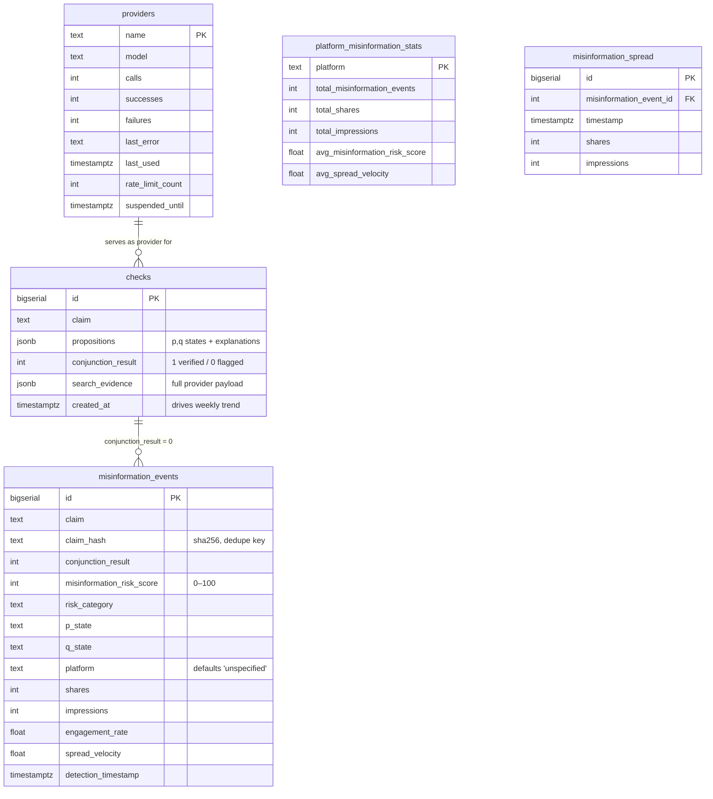
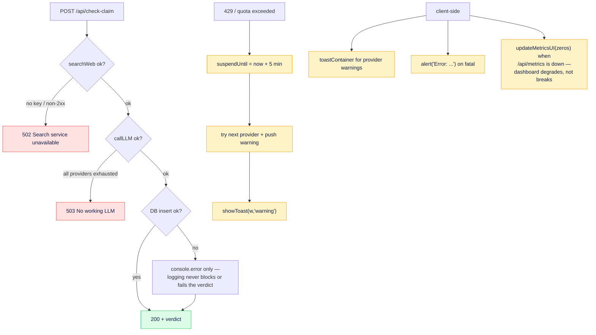

# VerifiedPulse — End-to-End System Diagram

How a user-pasted claim becomes a logic verdict, gets stored, and drives the Visual Metrics dashboard.

---

## 1. Master Flow: Claim → Verdict → Storage → Metrics

---

## 2. Logic Core: `p ∧ q` with three states

```mermaid
flowchart LR
    subgraph TRUTH["Truth table rendered in the UI"]
        T["p │ q │ p ∧ q<br/>T │ T │ T ← only Verified<br/>T │ F │ F<br/>F │ T │ F<br/>F │ F │ F"]
    end

    subgraph RISK["Risk scoring (lib/risk.js)"]
        R["CORNER_SCORE<br/>true|true → 0<br/>true|false → 40<br/>false|true → 55<br/>false|false → 90"]
        I["interpolate(wP, wQ)<br/>unverified = 0.5<br/>sits halfway between<br/>supported and refuted"]
        R --> I --> S["riskScore 0–100"]
    end

    subgraph CAT["Category → user-facing message"]
        C1["verified → '✅ Status: Verified'"]
        C2["uncorroborated-official"]
        C3["possible-misinterpretation<br/>'not necessarily misinformation'"]
        C4["likely-fabrication<br/>→ candidate = TRUE"]
        C5["insufficient-evidence"]
        C6["unsupported-claim<br/>→ candidate = TRUE"]
    end

    S --> CAT
    TRUTH -. "conjunction false" .-> RISK

    classDef good fill:#dcfce7,stroke:#22c55e,color:#0f1a41
    classDef warn fill:#fef3c7,stroke:#f59e0b,color:#0f1a41
    classDef bad fill:#fee2e2,stroke:#ef4444,color:#0f1a41
    class C1 good
    class C2,C3,C5 warn
    class C4,C6 bad
```

**Key point:** a failed conjunction is *not* automatically misinformation. The three-state model separates
"fabricated" (`likely-fabrication`, `unsupported-claim`) from "silent evidence" (`insufficient-evidence`) and
"distorted real reporting" (`possible-misinterpretation`).

---

## 3. Storage Schema → Metrics Consumers

| Stored column | Read by | Rendered as |
|---|---|---|
| `checks` (all rows) | Q1 count | `statTotal` — Claims Checked |
| `checks.conjunction_result = 1` | Q2 | `statVerified`, Verified Rate % |
| `checks` total − verified | Q2 | `statFlagged` — Flagged Risky |
| `checks.created_at` | Q3 | `chartTrend` line/area (7 buckets) |
| `checks.search_evidence` JSON | Q3 | `chartSources` — keyword scan vs `TRUSTED_CATEGORIES` |
| `misinformation_events` (all rows) | Q4 | `statMisinfoTotal`, `statMisinfoActive` |
| `misinformation_risk_score` | Q4 | `statMisinfoAvgRisk`, `chartRisk` doughnut buckets (<30 / 30–70 / ≥70) |
| `risk_category` | Q4 | `chartCategory` horizontal bars |
| `providers.calls / successes / failures` | upsert only | provider rotation health, `GET /api/providers` |

---

## 4. Resilience & Failure Paths

---

## 5. File Map

| File | Role in the pipeline |
|---|---|
| `index.html` | Claim input, `evaluateClaim()`, `displayResults()`, truth table, stat tiles, quiz |
| `assets/charts.js` | Six Chart.js renderers + `emptyState` placeholder plugin, bound to `/api/metrics` |
| `server.js` | Express routes: `POST /api/check-claim`, `GET /api/providers`, `GET /api/metrics` |
| `lib/check-claim-handler.js` | Orchestrator: search → format → LLM → verdict → persist → respond |
| `lib/llm-providers.js` | Fixed propositions, evidence formatting, provider pool, rotation, 3-state prompt rules |
| `lib/risk.js` | Bilinear risk scoring, category + severity labels, misinformation-candidate test |
| `lib/database.js` | Supabase writes (`insertCheck`, `insertMisinformationEvent`, `upsertProviderStats`) and all metric aggregation |
| `api/metrics.js` | Thin HTTP wrapper around `getMetrics()` |
| `supabase-*.sql` | Table definitions for `checks`, `providers`, `misinformation_*`, `platform_misinformation_stats` |